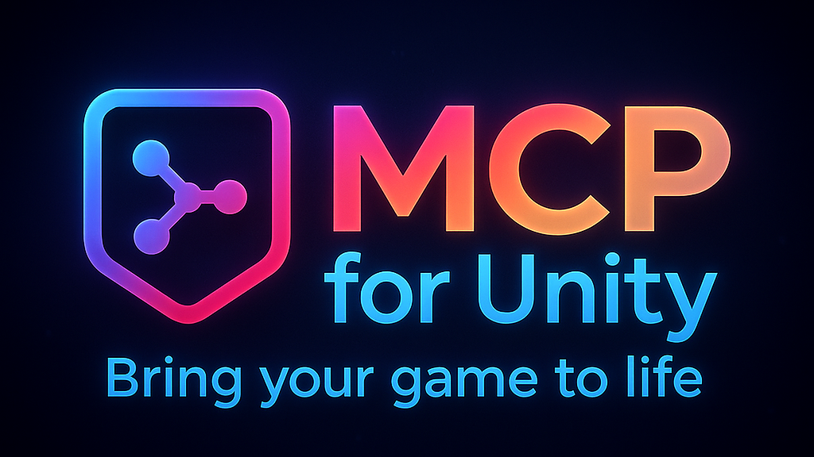
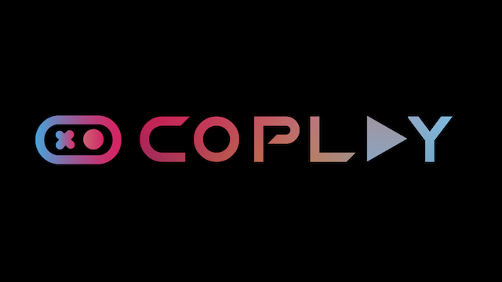

| [English](README.md) | [简体中文](docs/i18n/README-zh.md) |
|----------------------|---------------------------------|

#### Proudly sponsored and maintained by [Coplay](https://www.coplay.dev/?ref=unity-mcp) -- the best AI assistant for Unity.

[](https://discord.gg/y4p8KfzrN4)
[](https://www.coplay.dev/?ref=unity-mcp)
[](https://unity.com/releases/editor/archive)
[](https://assetstore.unity.com/packages/tools/generative-ai/mcp-for-unity-ai-driven-development-329908)
[](https://www.python.org)
[](https://modelcontextprotocol.io/introduction)
[](https://opensource.org/licenses/MIT)

**Create your Unity apps with LLMs!** MCP for Unity bridges AI assistants (Claude, Cursor, VS Code, etc.) with your Unity Editor via the [Model Context Protocol](https://modelcontextprotocol.io/introduction). Give your LLM the tools to manage assets, control scenes, edit scripts, and automate tasks.


> [!NOTE]
> This repo now ships a **CLI-only lightweight server** (no MCP client endpoints). Legacy MCP server code is preserved in `Server/legacy_mcp`.

---

## Quick Start

### Prerequisites

* **Unity 2021.3 LTS+** — [Download Unity](https://unity.com/download)
* **Python 3.10+** and **uv** — [Install uv](https://docs.astral.sh/uv/getting-started/installation/)
* **A terminal** — for running the local CLI

### 1. Install the Unity Package

In Unity: `Window > Package Manager > + > Add package from git URL...`

> [!TIP]
> ```text
> https://github.com/CoplayDev/unity-mcp.git?path=/MCPForUnity
> ```

**Want the latest beta?** Use the beta branch:
```text
https://github.com/CoplayDev/unity-mcp.git?path=/MCPForUnity#beta
```

<details>
<summary>Other install options (Asset Store, OpenUPM)</summary>

**Unity Asset Store:**
1. Visit [MCP for Unity on the Asset Store](https://assetstore.unity.com/packages/tools/generative-ai/mcp-for-unity-ai-driven-development-329908)
2. Click `Add to My Assets`, then import via `Window > Package Manager`

**OpenUPM:**
```bash
openupm add com.coplaydev.unity-mcp
```
</details>

### 2. Start the Server & Connect

1. In Unity: `Window > MCP for Unity`
2. Click **Start Server** (launches HTTP server on `localhost:8080`)
3. Unity will auto-connect to the local server (no MCP client required)
4. Use the CLI from your terminal

> [!TIP]
> **CLI usage:**
> ```bash
> # Start the server (HTTP)
> mcp-for-unity --http-url http://localhost:8080
>
> # Use the CLI
> unity-mcp status
> unity-mcp scene hierarchy
> ```
> Unity will auto-connect to the local server when HTTP scope is Local, so the MCP for Unity window is optional.

---

<details>
<summary><strong>Features & Tools</strong></summary>

### Key Features
* **CLI-first control** — Drive Unity Editor tasks from the terminal
* **Powerful Tools** — Manage assets, scenes, materials, scripts, and editor functions
* **Automation** — Automate repetitive Unity workflows
* **Extensible** — Custom tools registered by Unity projects

### Available Tools
`manage_asset` • `manage_editor` • `manage_gameobject` • `manage_components` • `manage_material` • `manage_prefabs` • `manage_scene` • `manage_script` • `manage_scriptable_object` • `manage_shader` • `manage_vfx` • `manage_texture` • `batch_execute` • `find_gameobjects` • `find_in_file` • `read_console` • `refresh_unity` • `run_tests` • `get_test_job` • `execute_menu_item` • `apply_text_edits` • `script_apply_edits` • `validate_script` • `create_script` • `delete_script` • `get_sha`

**Performance Tip:** Use `batch_execute` for multiple operations — it's 10-100x faster than individual calls!
</details>

<details>
<summary><strong>Multiple Unity Instances</strong></summary>

Unity MCP supports multiple Unity Editor instances. To target a specific one with the CLI:

1. Run `unity-mcp instance list`
2. Pass `--instance Name@hash` (or set `UNITY_MCP_INSTANCE`)
</details>

<details>
<summary><strong>Roslyn Script Validation (Advanced)</strong></summary>

For **Strict** validation that catches undefined namespaces, types, and methods:

1. Install [NuGetForUnity](https://github.com/GlitchEnzo/NuGetForUnity)
2. `Window > NuGet Package Manager` → Install `Microsoft.CodeAnalysis` v5.0
3. Also install `SQLitePCLRaw.core` and `SQLitePCLRaw.bundle_e_sqlite3` v3.0.2
4. Add `USE_ROSLYN` to `Player Settings > Scripting Define Symbols`
5. Restart Unity

  <details>
  <summary>Manual DLL installation (if NuGetForUnity isn't available)</summary>

  1. Download `Microsoft.CodeAnalysis.CSharp.dll` and dependencies from [NuGet](https://www.nuget.org/packages/Microsoft.CodeAnalysis.CSharp/)
  2. Place DLLs in `Assets/Plugins/` folder
  3. Ensure .NET compatibility settings are correct
  4. Add `USE_ROSLYN` to Scripting Define Symbols
  5. Restart Unity
  </details>
</details>

<details>
<summary><strong>Troubleshooting</strong></summary>

* **Unity Bridge Not Connecting:** Check `Window > MCP for Unity` status, restart Unity
* **Server Not Starting:** Verify `uv --version` works, check the terminal for errors
* **CLI Not Connecting:** Ensure the HTTP server is running and the URL matches your CLI config

**Detailed setup guides:**
* [Common Setup Problems](https://github.com/CoplayDev/unity-mcp/wiki/3.-Common-Setup-Problems) — macOS dyld errors, FAQ

Still stuck? [Open an Issue](https://github.com/CoplayDev/unity-mcp/issues) or [Join Discord](https://discord.gg/y4p8KfzrN4)
</details>

<details>
<summary><strong>Contributing</strong></summary>

See [README-DEV.md](docs/development/README-DEV.md) for development setup. For custom tools, see [CUSTOM_TOOLS.md](docs/reference/CUSTOM_TOOLS.md).

1. Fork → Create issue → Branch (`feature/your-idea`) → Make changes → PR
</details>

<details>
<summary><strong>Telemetry & Privacy</strong></summary>

Telemetry is disabled in the CLI-only server. Legacy notes are in [TELEMETRY.md](Server/legacy_mcp/docs/TELEMETRY.md).
</details>

---

**License:** MIT — See [LICENSE](LICENSE) | **Need help?** [Discord](https://discord.gg/y4p8KfzrN4) | [Issues](https://github.com/CoplayDev/unity-mcp/issues)

---

## Star History

[](https://www.star-history.com/#CoplayDev/unity-mcp&Date)

<details>
<summary><strong>Citation for Research</strong></summary>
If you are working on research that is related to Unity-MCP, please cite us!

```bibtex
@inproceedings{10.1145/3757376.3771417,
author = {Wu, Shutong and Barnett, Justin P.},
title = {MCP-Unity: Protocol-Driven Framework for Interactive 3D Authoring},
year = {2025},
isbn = {9798400721366},
publisher = {Association for Computing Machinery},
address = {New York, NY, USA},
url = {https://doi.org/10.1145/3757376.3771417},
doi = {10.1145/3757376.3771417},
series = {SA Technical Communications '25}
}
```
</details>

## Unity AI Tools by Coplay

Coplay offers 3 AI tools for Unity:
- **MCP for Unity** is available freely under the MIT license.
- **Coplay** is a premium Unity AI assistant that sits within Unity and is more than the MCP for Unity.
- **Coplay MCP** a free-for-now MCP for Coplay tools.

(These tools have different tech stacks. See this blog post [comparing Coplay to MCP for Unity](https://coplay.dev/blog/coplay-vs-coplay-mcp-vs-unity-mcp).)



## Disclaimer

This project is a free and open-source tool for the Unity Editor, and is not affiliated with Unity Technologies.
